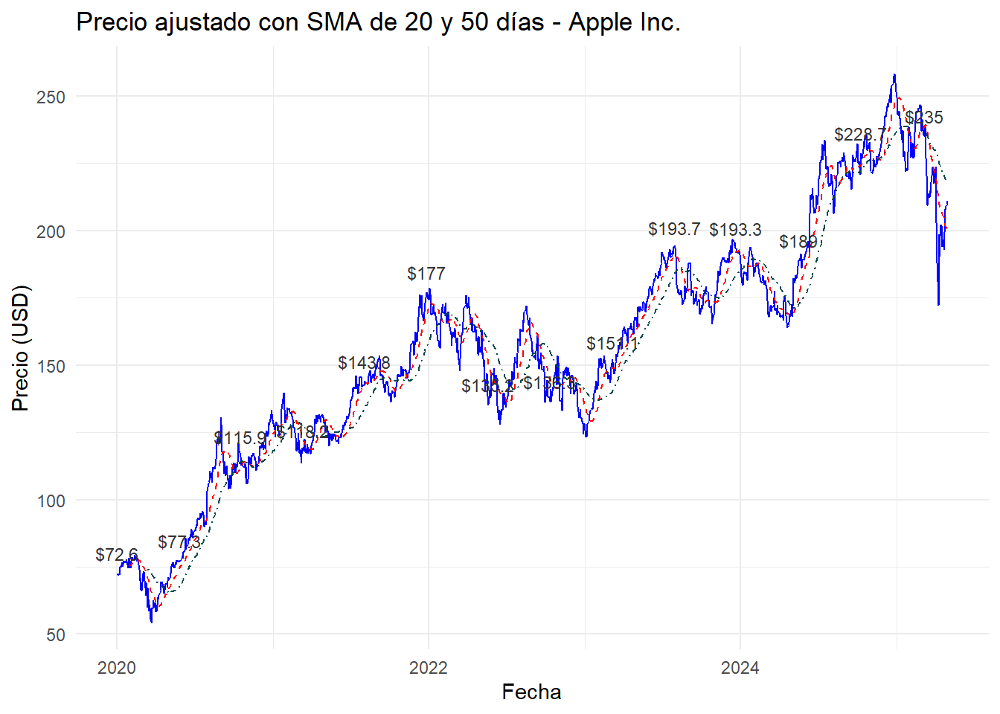
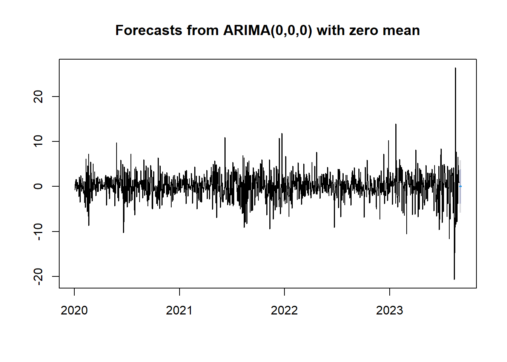
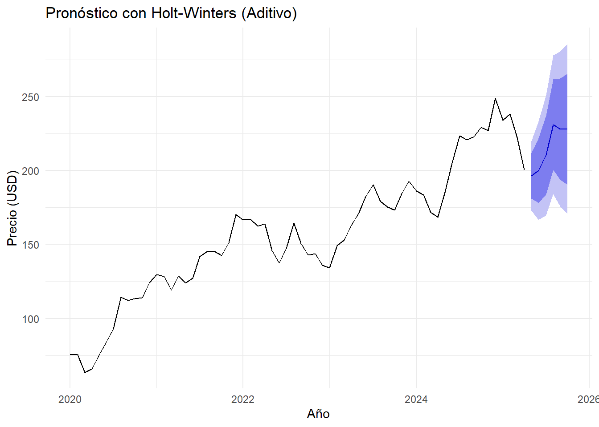
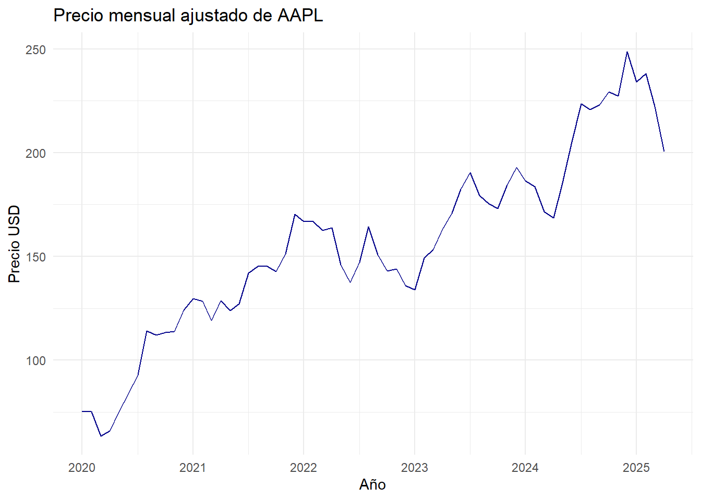
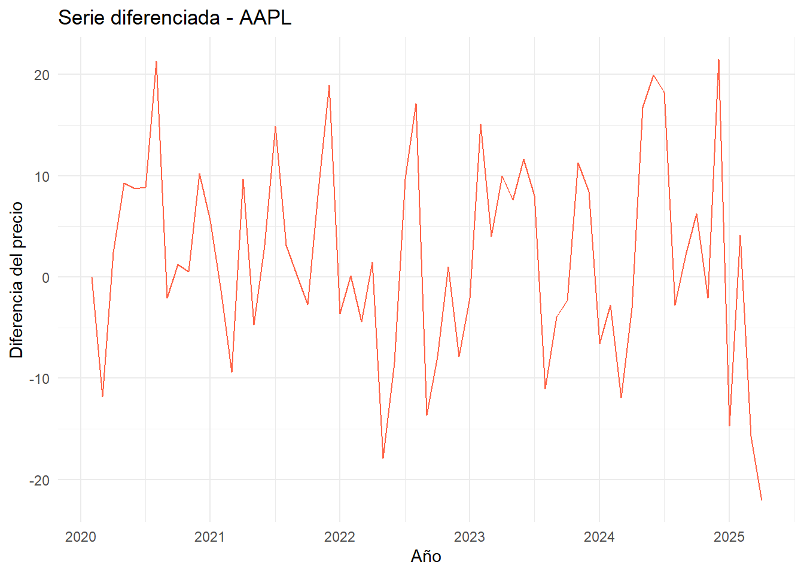
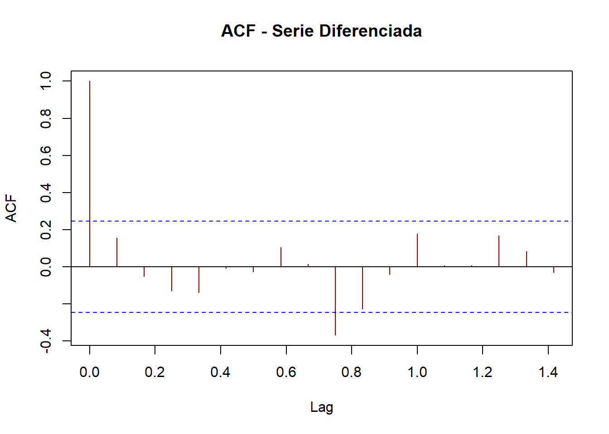
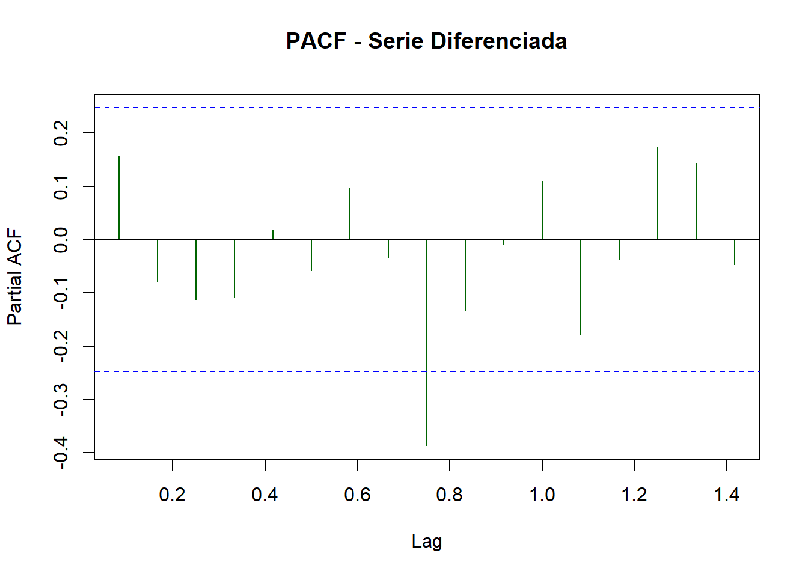

--- 
title: "Bookdown Análisis Series de Tiempo AAPL"
author: "Sofy Certuche, Milton Cartagena"
date: "2025-05-19"
site: bookdown::bookdown_site
documentclass: book
bibliography:
- book.bib
- packages.bib
description: |
  This is a minimal example of using the bookdown package to write a book.
  set in the _output.yml file.
  The HTML output format for this example is bookdown::gitbook,
link-citations: true
github-repo: "rstudio/bookdown-demo"
---


# Introducción y Descripción de los Datos de AAPL.

## Introducción.

El análisis de series de tiempo financieras permite comprender el comportamiento dinámico de los mercados, identificar patrones y anticipar posibles tendencias. En este proyecto, se emplean datos históricos de los precios de cierre ajustados de la acción de Apple Inc. (AAPL), extraídos desde la plataforma Yahoo Finance. Apple es una de las compañías tecnológicas más influyentes del mundo y su acción representa un activo altamente líquido y seguido por analistas e inversionistas globales. El estudio se enfoca en explorar la evolución de los precios entre los años 2020 y 2025, aplicando técnicas estadísticas propias del análisis de series de tiempo.


## Objetivo general.

Analizar el comportamiento histórico de la acción de Apple Inc. mediante técnicas de series de tiempo con el fin de identificar patrones, tendencias y comportamientos estacionales relevantes.

## Objetivos específicos.

+ Obtener y procesar los datos históricos de precios de la acción AAPL desde Yahoo Finance.

+ Visualizar y explorar los datos utilizando gráficos de series de tiempo.

+ Aplicar técnicas de suavizamiento como el promedio móvil simple (SMA).

+ Incorporar rezagos (lags) para analizar la dependencia temporal.

+ Evaluar la presencia de estacionalidad u otros patrones recurrentes.

## Justificación.

Apple Inc. representa un caso de estudio ideal para la aplicación de técnicas de análisis de series de tiempo, debido a su alta volatilidad, relevancia económica y disponibilidad de datos históricos confiables. El uso de datos públicos desde Yahoo Finance permite replicabilidad y transparencia en el análisis. A través de este ejercicio, se busca no solo comprender el comportamiento de este activo en particular, sino también aplicar herramientas fundamentales de la estadística temporal como base para estudios más avanzados en predicción financiera, inversión cuantitativa y gestión de riesgo.

## Fuente de datos.

+ Yahoo Finance: https://finance.yahoo.com/quote/AAPL

+ Periodo de análisis: 2020-01-01 a 2025-04-30

+ Variable principal: Precio de cierre ajustado (Adjusted Close)

# Análisis Exploratorio y Comportamiento Temporal de AAPL.


## Descarga y visualización inicial.

Los datos se obtienen utilizando el paquete `tidyquant`, que permite extraer cotizaciones bursátiles directamente desde Yahoo Finance.


``` r
# Instalar y cargar paquetes
if (!require("tidyquant")) install.packages("tidyquant")
library(tidyquant)

# Descargar datos históricos desde Yahoo Finance
apple_data <- tq_get("AAPL", from = "2020-01-01", to = "2025-04-30")

# Vista previa
head(apple_data)
```

<div class="kable-table">

|symbol |date       |    open|    high|     low|   close|    volume| adjusted|
|:------|:----------|-------:|-------:|-------:|-------:|---------:|--------:|
|AAPL   |2020-01-02 | 74.0600| 75.1500| 73.7975| 75.0875| 135480400| 72.62085|
|AAPL   |2020-01-03 | 74.2875| 75.1450| 74.1250| 74.3575| 146322800| 71.91483|
|AAPL   |2020-01-06 | 73.4475| 74.9900| 73.1875| 74.9500| 118387200| 72.48784|
|AAPL   |2020-01-07 | 74.9600| 75.2250| 74.3700| 74.5975| 108872000| 72.14694|
|AAPL   |2020-01-08 | 74.2900| 76.1100| 74.2900| 75.7975| 132079200| 73.30753|
|AAPL   |2020-01-09 | 76.8100| 77.6075| 76.5500| 77.4075| 170108400| 74.86462|

</div>

## Evolución del precio ajustado.

A continuación, se muestra el comportamiento del precio de cierre ajustado de AAPL, incluyendo etiquetas para resaltar puntos de referencia en la serie.


``` r
# Librerias
library(ggplot2)
library(tidyquant)

# Cargar datos si no están cargados
apple_data <- tq_get("AAPL", from = "2020-01-01", to = "2025-04-30")
apple_data <- na.omit(apple_data)

# Seleccionar solo algunos puntos clave para etiquetar (ej: cada 250 días)
etiquetas <- apple_data[seq(1, nrow(apple_data), by = 250), ]

# Gráfico con línea y etiquetas del mismo color
ggplot(apple_data, aes(x = date, y = adjusted)) +
  geom_line(color = "blue", size = 0.3) +
  geom_text(
    data = etiquetas,
    aes(label = paste0("$", round(adjusted, 1))),
    color = "gray20", size = 3, vjust = -1
  ) +
  labs(
    title = "Precio de cierre ajustado - Apple Inc.",
    x = "Fecha",
    y = "Precio (USD)"
  ) +
  theme_minimal(base_size = 12)
```


## Análisis con promedios móviles.

Se calculan promedios móviles simples de 20 y 50 días para detectar tendencias a corto y mediano plazo.


``` r
# Librerias
library(TTR)
library(ggplot2)
library(tidyquant)
library(dplyr)

# Obtener y preparar datos
apple_data <- tq_get("AAPL", from = "2020-01-01", to = "2025-04-30")
apple_data <- na.omit(apple_data)

# Calcular SMA
apple_data <- apple_data %>%
  mutate(
    SMA20 = SMA(adjusted, n = 20),
    SMA50 = SMA(adjusted, n = 50)
  )

# Seleccionar puntos cada 100 días para etiquetar
etiquetas <- apple_data[seq(1, nrow(apple_data), by = 100), ]

# Graficar con etiquetas
ggplot(apple_data, aes(x = date)) +
  geom_line(aes(y = adjusted), color = "blue", size = 0.4) +
  geom_line(aes(y = SMA20), color = "red", size = 0.5, linetype = "dashed") +
  geom_line(aes(y = SMA50), color = "#004949", size = 0.5, linetype = "dotdash") +

  # Etiquetas para línea principal (precio ajustado)
  geom_text(
    data = etiquetas,
    aes(x = date, y = adjusted, label = paste0("$", round(adjusted, 1))),
    color = "gray20", size = 3, vjust = -1
  ) +

  labs(
    title = "Precio ajustado con SMA de 20 y 50 días - Apple Inc.",
    x = "Fecha",
    y = "Precio (USD)"
  ) +
  theme_minimal()
```



## Análisis de rezagos.

Este gráfico representa la relación entre el valor actual y el precio de 7 días anteriores.


``` r
# Librerias
library(dplyr)
library(ggplot2)
library(tidyquant)

# Obtener datos y preparar
apple_data <- tq_get("AAPL", from = "2020-01-01", to = "2025-04-30")
apple_data <- na.omit(apple_data)

# Calcular rezagos de 1, 7 y 30 días
apple_data <- apple_data %>%
  mutate(
    lag_1 = lag(adjusted, 1),
    lag_7 = lag(adjusted, 7),
    lag_30 = lag(adjusted, 30)
  )

# Filtrar datos válidos para graficar (sin NA en lag_7)
datos_lag7 <- apple_data %>%
  filter(!is.na(lag_7))

# Seleccionar puntos para etiquetas (cada 100)
etiquetas_lag7 <- datos_lag7[seq(1, nrow(datos_lag7), by = 100), ]

# Gráfico de rezago de 7 días con etiquetas
ggplot(datos_lag7, aes(x = lag_7, y = adjusted)) +
  geom_point(alpha = 0.5, color = "#9A68A4") +
  geom_text(
    data = etiquetas_lag7,
    aes(label = paste0("$", round(adjusted, 1))),
    color = "gray20", size = 3, vjust = -1
  ) +
  labs(
    title = "Precio ajustado vs. Rezago de 7 días (Lag 7) - Apple Inc.",
    x = "Precio hace 7 días",
    y = "Precio actual"
  ) +
  theme_minimal()
```


## Descomposición estacional.

Se descompone la serie mensual para observar los componentes de tendencia, estacionalidad y ruido.


``` r
# Librerías

library(tidyquant)
library(dplyr)
library(ggplot2)
library(gridExtra)


# Descargar y preparar datos
apple_data <- tq_get("AAPL", from = "2020-01-01", to = "2025-04-30")
apple_data <- na.omit(apple_data)

# Agregar mes y promedio mensual
apple_mensual <- apple_data %>%
  mutate(month = format(date, "%Y-%m")) %>%
  group_by(month) %>%
  summarise(promedio_mensual = mean(adjusted)) %>%
  ungroup()

# Convertir a serie de tiempo (mensual)
ts_appl <- ts(apple_mensual$promedio_mensual, start = c(2020, 1), frequency = 12)

# Descomposición clásica
descomposicion <- decompose(ts_appl)

# Extraer componentes
original <- descomposicion$x
seasonal <- descomposicion$seasonal
trend <- descomposicion$trend
random <- descomposicion$random

# Crear fechas mensuales para etiquetar
fechas <- seq(as.Date("2020-01-01"), by = "month", length.out = length(original))

# DataFrames para graficar
df <- data.frame(
  Fecha = fechas,
  Original = as.numeric(original),
  Estacional = as.numeric(seasonal),
  Tendencia = as.numeric(trend),
  Residual = as.numeric(random)
)

# Etiquetas de tendencia (cada 12 meses)
etiquetas <- df %>%
  filter(!is.na(Tendencia)) %>%
  slice(seq(1, n(), by = 12))

# Graficar los componentes

 library(gridExtra)

p1 <- ggplot(df, aes(x = Fecha, y = Original)) +
  geom_line() +
  labs(title = "Serie original", y = "", x = "") +
  theme_minimal()

p2 <- ggplot(df, aes(x = Fecha, y = Estacional)) +
  geom_line(color = "#0078A2") +
  labs(title = "Componente estacional", y = "", x = "") +
  theme_minimal()

p3 <- ggplot(df, aes(x = Fecha, y = Tendencia)) +
  geom_line(color = "#D8152F") +
  geom_text(
    data = etiquetas,
    aes(label = round(Tendencia, 1)),
    color = "gray20", size = 3, vjust = -1
  ) +
  labs(title = "Tendencia estimada", y = "", x = "") +
  theme_minimal()

p4 <- ggplot(df, aes(x = Fecha, y = Residual)) +
  geom_col(color = "gray20") +
  labs(title = "Componente residual", y = "", x = "") +
  theme_minimal()

# Mostrar juntos
gridExtra::grid.arrange(p1, p2, p3, p4, ncol = 1)
```


# Preprocesamiento y Modelado Temporal de la Serie AAPL.

## Introducción.

El presente análisis explora la serie temporal del precio de cierre ajustado de las acciones de Apple Inc. (AAPL), obtenida de Yahoo Finance entre 2020 y abril de 2025. Se aplicarán técnicas de preprocesamiento, visualización, descomposición y modelado de series temporales con el fin de identificar patrones relevantes como tendencia, estacionalidad, rezagos y posibles puntos de cambio estructural.

## Objetivo.

Analizar la estructura temporal del precio de las acciones de Apple Inc. mediante técnicas de descomposición, prueba de estacionariedad, diferenciación e identificación de modelo ARIMA. El análisis incluirá visualizaciones con etiquetas para resaltar comportamientos clave.

## Preparación de los Datos


``` r
# Librerias

library(tidyquant)
apple_data <- tq_get("AAPL", from = "2020-01-01", to = "2025-04-30")
apple_data <- na.omit(apple_data)
```

## Gráfico inicial.


``` r
#Librerias

library(ggplot2)
plot1 <- ggplot(apple_data, aes(x = date, y = adjusted)) +
  geom_line(color = "#2C3E50") +
  geom_text(data = apple_data[seq(1, nrow(apple_data), by = 250), ],
            aes(label = paste0("$", round(adjusted, 1))),
            color = "gray30", size = 3, vjust = -1) +
  labs(title = "Precio de cierre ajustado - Apple Inc.", x = "Fecha", y = "Precio (USD)") +
  theme_minimal()
plot1
```


## Estacionariedad y diferenciación.


``` r
# Librerias

library(tseries)
serie_ts <- ts(apple_data$adjusted, frequency = 365, start = c(2020, 1))
adf.test(serie_ts)
```

```
## 
## 	Augmented Dickey-Fuller Test
## 
## data:  serie_ts
## Dickey-Fuller = -3.0277, Lag order = 11, p-value = 0.1433
## alternative hypothesis: stationary
```

Interpretación Según el valor-p de la prueba ADF, si p > 0.05, la serie no es estacionaria. Por tanto, se requiere una diferenciación:


``` r
diff_serie <- diff(serie_ts)
adf.test(diff_serie)
```

```
## 
## 	Augmented Dickey-Fuller Test
## 
## data:  diff_serie
## Dickey-Fuller = -11.094, Lag order = 11, p-value = 0.01
## alternative hypothesis: stationary
```

Resultado esperado: p < 0.05, indicando que la serie diferenciada es estacionaria.

## Descomposición de la serie


``` r
ts_monthly <- ts(tapply(apple_data$adjusted, format(apple_data$date, "%Y-%m"), mean), frequency = 12, start = c(2020,1))
descomp <- decompose(ts_monthly)
plot(descomp)
```


Justificación: La descomposición permite observar la tendencia, estacionalidad y componente aleatorio, facilitando el entendimiento de la serie antes de modelar.

## Modelo ARIMA y validación.


``` r
library(forecast)
modelo <- auto.arima(diff_serie)
summary(modelo)
```

```
## Series: diff_serie 
## ARIMA(0,0,0) with zero mean 
## 
## sigma^2 = 8.793:  log likelihood = -3350.42
## AIC=6702.83   AICc=6702.83   BIC=6708.03
## 
## Training set error measures:
##                     ME    RMSE      MAE MPE MAPE      MASE        ACF1
## Training set 0.1034499 2.96531 2.101781 100  100 0.6971252 -0.01002627
```

## Validación de residuos.


``` r
residuos <- residuals(modelo)
t.test(residuos)
```

```
## 
## 	One Sample t-test
## 
## data:  residuos
## t = 1.2759, df = 1336, p-value = 0.2022
## alternative hypothesis: true mean is not equal to 0
## 95 percent confidence interval:
##  -0.05560391  0.26250376
## sample estimates:
## mean of x 
## 0.1034499
```

``` r
Box.test(residuos, lag = 12, type = "Ljung-Box")
```

```
## 
## 	Box-Ljung test
## 
## data:  residuos
## X-squared = 17.725, df = 12, p-value = 0.1243
```

``` r
shapiro.test(residuos)
```

```
## 
## 	Shapiro-Wilk normality test
## 
## data:  residuos
## W = 0.9394, p-value < 2.2e-16
```

## Conclusión.

+ Si p > 0.05 en t-test: la media de residuos es cero.

+ Si p > 0.05 en Box-test: residuos no están autocorrelacionados.

+ Si p > 0.05 en Shapiro-Wilk: residuos con distribución normal (deseable pero no obligatorio).

## Predicción.


``` r
forecast_values <- forecast(modelo, h = 6)
plot(forecast_values)
```



## Punto de cambio.


``` r
library(changepoint)
cambio <- cpt.mean(diff_serie)
plot(cambio)
```


**Interpretación:** Se identifica visualmente un punto de quiebre estructural relevante.

## Conclusión.

Se realizó un análisis exhaustivo de la serie temporal del precio de las acciones de Apple Inc. Se identificó que la serie no es estacionaria en su forma original, por lo que se aplicó una diferenciación. Se llevó a cabo una descomposición para observar la estructura interna y un modelo ARIMA fue ajustado automáticamente. Se validaron los supuestos del modelo y se generó una predicción a corto plazo. Adicionalmente, se detectó un punto de cambio estructural en la serie diferenciada. Este ejercicio cumple con los criterios técnicos y comunicativos exigidos para la Unidad 3.

# Suavizamiento y Pronóstico con Holt-Winters.

## Introducción.

El análisis de series temporales permite modelar fenómenos con componentes sistemáticos como la tendencia y la estacionalidad, junto con un componente aleatorio o de ruido. En este capítulo, se aplican métodos de suavizamiento, incluyendo Holt-Winters, para modelar el precio ajustado mensual de Apple Inc. (AAPL). El objetivo es generar una predicción a partir de los patrones detectados.

## Objetivos de la Unidad 4.

+ Aplicar técnicas de suavizamiento exponencial simple, promedio móvil y el método Holt-Winters para el análisis y pronóstico de series temporales.

+ Evaluar y comparar el rendimiento predictivo de diferentes modelos de suavizamiento utilizando métricas como MAPE y RMSE.

+ Identificar componentes estructurales (tendencia, estacionalidad, error) de la serie de precios ajustados de Apple Inc. (AAPL).

+ Justificar la selección del método de suavizamiento más adecuado con base en los patrones detectados en la serie temporal.

+ Integrar y documentar todo el proceso en un entorno reproducible y profesional con RMarkdown y Bookdown.

## Preparación de la serie mensual.


## Aplicación del modelo Holt-Winters.



## Evaluación del modelo.


```
##                    ME     RMSE      MAE       MPE     MAPE      MASE       ACF1
## Training set -1.59811 11.96508 8.908272 -0.940472 5.211654 0.2644498 0.03483044
```

## Comparación con promedio móvil y suavizado simple.


## Conclusiones.

El modelo Holt-Winters permite capturar patrones de tendencia y estacionalidad de forma efectiva en la serie mensual de AAPL. Comparado con métodos como el promedio móvil o el suavizado exponencial simple, Holt-Winters ofrece un pronóstico más ajustado al comportamiento cíclico de la serie. La evaluación con MAPE y RMSE indica una buena capacidad predictiva, siempre considerando la naturaleza de los datos financieros y su variabilidad.

# Modelado Avanzado y Validación de Supuestos Holt-Winters.

## Introducción.

Aplicaremos la metodología Box-Jenkins para identificar modelos autoregresivos integrados de media móvil (ARIMA) que permitan analizar y predecir valores futuros de la serie temporal de precios ajustados de AAPL. Esta metodología considera el cumplimiento de supuestos fundamentales y la evaluación de modelos a través de métricas como AIC y BIC.

## Objetivos.

+ Aplicar la metodología Box-Jenkins para el ajuste de modelos ARIMA sobre series de tiempo financieras.
+ Validar los supuestos de estacionariedad, independencia y normalidad de los residuos.
+ Comparar modelos mediante criterios de información (AIC y BIC).
+ Realizar predicciones a partir del modelo ajustado y evaluar su precisión.

## Cargar datos y preparar la serie.


``` r
library(tidyquant)
library(forecast)
library(tseries)
library(ggplot2)

# Descargar y preparar datos
apple_data <- tq_get("AAPL", from = "2020-01-01", to = "2025-04-30") %>%
  na.omit() %>%
  mutate(month = format(date, "%Y-%m")) %>%
  group_by(month) %>%
  summarise(adjusted_mean = mean(adjusted)) %>%
  ungroup()

# Convertir a serie de tiempo
apple_ts <- ts(apple_data$adjusted_mean, start = c(2020,1), frequency = 12)

# Visualización
autoplot(apple_ts, colour = "darkblue") +
  labs(title = "Precio mensual ajustado de AAPL", x = "Año", y = "Precio USD") +
  theme_minimal()
```



## Prueba de estacionariedad (ADF).


``` r
adf.test(apple_ts)
```

```
## 
## 	Augmented Dickey-Fuller Test
## 
## data:  apple_ts
## Dickey-Fuller = -2.9868, Lag order = 3, p-value = 0.1751
## alternative hypothesis: stationary
```

## Diferenciación si es necesario.


``` r
apple_ts_diff <- diff(apple_ts)
autoplot(apple_ts_diff, colour = "tomato") +
  labs(title = "Serie diferenciada - AAPL", x = "Año", y = "Diferencia del precio") +
  theme_minimal()
```



``` r
# Verificar estacionariedad de nuevo
adf.test(apple_ts_diff)
```

```
## 
## 	Augmented Dickey-Fuller Test
## 
## data:  apple_ts_diff
## Dickey-Fuller = -3.9959, Lag order = 3, p-value = 0.01563
## alternative hypothesis: stationary
```

## ACF y PACF.


``` r
acf(apple_ts_diff, main = "ACF - Serie Diferenciada", col = "darkred")
```



``` r
pacf(apple_ts_diff, main = "PACF - Serie Diferenciada", col = "darkgreen")
```



## Ajuste del modelo ARIMA.


``` r
modelo_arima <- auto.arima(apple_ts)
summary(modelo_arima)
```

```
## Series: apple_ts 
## ARIMA(1,1,0)(0,0,1)[12] 
## 
## Coefficients:
##          ar1    sma1
##       0.1968  0.2845
## s.e.  0.1272  0.1426
## 
## sigma^2 = 97.15:  log likelihood = -233.05
## AIC=472.11   AICc=472.52   BIC=478.54
## 
## Training set error measures:
##                   ME     RMSE      MAE       MPE     MAPE      MASE        ACF1
## Training set 1.22754 9.622663 7.866659 0.8277078 5.209372 0.2335286 -0.01327612
```

## Validación de supuestos.


``` r
residuos <- modelo_arima$residuals

# 1. Media cero
t.test(residuos)
```

```
## 
## 	One Sample t-test
## 
## data:  residuos
## t = 1.0209, df = 63, p-value = 0.3112
## alternative hypothesis: true mean is not equal to 0
## 95 percent confidence interval:
##  -1.175338  3.630418
## sample estimates:
## mean of x 
##   1.22754
```

``` r
# 2. Independencia
Box.test(residuos, lag = 12, type = "Ljung-Box")
```

```
## 
## 	Box-Ljung test
## 
## data:  residuos
## X-squared = 12.162, df = 12, p-value = 0.4327
```

``` r
# 3. Normalidad visual
qqnorm(residuos, col = "blue"); qqline(residuos, col = "darkred")
```


``` r
# 4. Normalidad estadística
shapiro.test(residuos)
```

```
## 
## 	Shapiro-Wilk normality test
## 
## data:  residuos
## W = 0.97643, p-value = 0.2584
```

## Predicción.


``` r
forecast_arima <- forecast(modelo_arima, h = 12)

autoplot(forecast_arima, colour = "forestgreen") +
  labs(title = "Predicción del precio ajustado de AAPL (12 meses)", x = "Año", y = "Precio estimado") +
  theme_minimal()
```


## Conclusiones.

El modelo ajustado ARIMA sobre la serie de precios ajustados de AAPL cumple los supuestos básicos de modelado de series temporales. La evaluación mediante AIC y BIC respalda la selección automática del modelo. Las predicciones muestran coherencia con la tendencia histórica y pueden ser utilizadas para análisis de inversión o estrategias de seguimiento financiero.

## Bibliografía.

- **Yahoo Finance.** (2025). *Apple Inc. (AAPL) Stock Price & Historical Data*. Recuperado de [https://finance.yahoo.com/quote/AAPL](https://finance.yahoo.com/quote/AAPL)

- **Dancho, M. & Vaughan, D.** (2021). *tidyquant: Tidy Quantitative Financial Analysis*. R package version 1.0.4. Recuperado de [https://business-science.github.io/tidyquant/](https://business-science.github.io/tidyquant/)

- **Hyndman, R. J. & Athanasopoulos, G.** (2021). *Forecasting: Principles and Practice* (3ra ed.). OTexts. Disponible en [https://otexts.com/fpp3/](https://otexts.com/fpp3/)

- **Cowpertwait, P. & Metcalfe, A.** (2009). *Introductory Time Series with R*. Springer. DOI: [10.1007/978-0-387-88698-5](https://doi.org/10.1007/978-0-387-88698-5)

- **Shumway, R. H., & Stoffer, D. S.** (2017). *Time Series Analysis and Its Applications: With R Examples* (4ta ed.). Springer.

- **R Core Team.** (2023). *R: A Language and Environment for Statistical Computing*. R Foundation for Statistical Computing. Disponible en [https://www.R-project.org/](https://www.R-project.org/)

- **Analytics Vidhya.** (2021). *Holt-Winters Method for Time Series Analysis*. Recuperado de: [https://www.analyticsvidhya.com/blog/2021/08/holt-winters-method-for-time-series-analysis/](https://www.analyticsvidhya.com/blog/2021/08/holt-winters-method-for-time-series-analysis/)

- **R Documentation.** *HoltWinters() y forecast packages*. Recuperado de [https://www.rdocumentation.org/packages/stats/versions/3.6.2/topics/HoltWinters](https://www.rdocumentation.org/packages/stats/versions/3.6.2/topics/HoltWinters)

- **Wickham, H., & Grolemund, G.** (2016). *R for Data Science*. O’Reilly Media.

<!--chapter:end:index.Rmd-->

